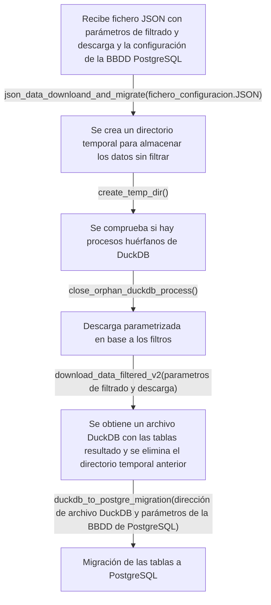

# MITMA-ISTAC-R

## Descripción

**MITMA-ISTAC-R** provee funciones para la descarga parametrizada de los datos de movilidad proporcionados por el Ministerio de Transportes y Movilidad Sostenible y su posterior migración a bases de datos PostgreSQL. Se utiliza el paquete R [Spanishoddata](https://github.com/rOpenSpain/spanishoddata) que permite el acceso y la descarga de los datos del Ministerio.

Para más información acerca del funcionamiento de las funciones del paquete de Spanishoddata se recomienda leer la [documentación asociada](https://ropenspain.github.io/spanishoddata/).

## Entrada

| Nombre                     | Descripción    |
| -------------------------- | -------------- |
| fichero_configuracion.JSON | Fichero con los parámetros descarga y filtrado y la configuración de la base de datos de PostgreSQL receptora. |

## Salida

Ficheros de salida o tablas.

| Nombre   | Descripción    |
| -------- | -------------- |
| salida-1 | some-text-here |
| salida-2 | some-text-here |

## Parámetros

| Parámetro   | Descripción    |
| ----------- | -------------- |
| parámetro-1 | some-text-here |
| parámetro-2 | some-text-here |

some-text-here

## Flujo

 El flujo sigue los siguientes pasos:
 
 1. Descarga en un directorio temporal los datos solicitados a través de la librería de Spanishoddata. 
 
 2. Realiza el filtrado mediante los parámetros deseados.
 
 3. Obtención de las tablas resultados en un fichero DuckDB. 
 
 4. Eliminación del directorio temporal para liberar espacio. 
 
 5. Migración de los datos a PostgreSQL.

### Esquema de flujo

## Requisitos

A continuación se desglosan las librerías utilizadas:

| Software / Librería | Versión                |
| ------------------- | ---------------------- |
| languageserver      | Más reciente           |
| lintr               | Más reciente           |
| styler              | Más reciente           |
| testthat            | Más reciente           |
| mockery             | Más reciente           |
| plumber             | Más reciente           |
| spanishoddata       | Más reciente           |
| dplyr               | Más reciente           |
| DBI                 | Más reciente           |
| uuid                | Más reciente           |
| RPostgres           | Más reciente           |
| duckdb              | Más reciente           |
| jsonlite            | Más reciente           |
| here                | Más reciente           |
| zonebuilder         | Más reciente           |
| tmaptools           | Más reciente           |
| sf                  | Más reciente           |

## Observaciones

some-text-here

## Responsable

* Responsable del desarrollo: _Joel Aday Dorta Hernández_
* Técnico estadístico responsable: _nombre-completo_