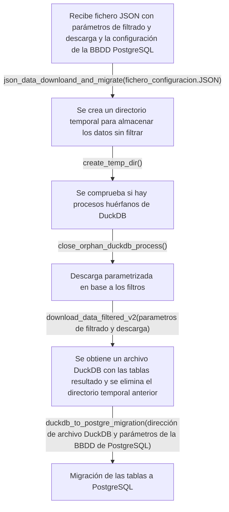

# MITMA-ISTAC-R

## Descripción

**MITMA-ISTAC-R** provee funciones para la descarga parametrizada de los datos de movilidad proporcionados por el [Ministerio de Transportes y Movilidad Sostenible](https://www.transportes.gob.es/ministerio/proyectos-singulares/estudios-de-movilidad-con-big-data/opendata-movilidad) y su posterior migración a bases de datos PostgreSQL. Se utiliza el paquete R [Spanishoddata](https://github.com/rOpenSpain/spanishoddata) que permite el acceso y la descarga de los datos del Ministerio.

Para más información acerca del funcionamiento de las funciones del paquete de Spanishoddata se recomienda leer la [documentación asociada](https://ropenspain.github.io/spanishoddata/).

## Entrada

| Nombre                     | Descripción    |
| -------------------------- | -------------- |
| fichero_configuracion.JSON | Fichero con los parámetros descarga y filtrado y la configuración de la base de datos de PostgreSQL receptora. |


## Flujo

 El flujo sigue los siguientes pasos:
 
 1. Descarga en un directorio temporal los datos solicitados a través de la librería de Spanishoddata. 
 
 2. Realiza el filtrado mediante los parámetros deseados.
 
 3. Obtención de las tablas resultados en un fichero DuckDB. 
 
 4. Eliminación del directorio temporal para liberar espacio. 
 
 5. Migración de los datos a PostgreSQL.

<br><br>


Figura 1: Esquema de flujo del proceso.

## Requisitos

A continuación se desglosan las librerías utilizadas y necesarias para el correcto funcionamiento de los distintos scripts desarrollados:

| Software / Librería | Versión                |
| ------------------- | ---------------------- |
| languageserver      | Más reciente           |
| lintr               | Más reciente           |
| styler              | Más reciente           |
| testthat            | Más reciente           |
| mockery             | Más reciente           |
| plumber             | Más reciente           |
| spanishoddata       | Más reciente           |
| dplyr               | Más reciente           |
| DBI                 | Más reciente           |
| uuid                | Más reciente           |
| RPostgres           | Más reciente           |
| duckdb              | Más reciente           |
| jsonlite            | Más reciente           |
| here                | Más reciente           |
| zonebuilder         | Más reciente           |
| tmaptools           | Más reciente           |
| sf                  | Más reciente           |

El archivo [`develop_packages.R`](/develop_packages.R) incluye todas las librerías usadas e instala aquellas que se necesiten.

## Observaciones

La descripción y ejemplos de uso de las funciones están incluidas en la documentación asociada y desarrollada para este proyecto. Igualmente se detallará aquí un ejemplo de contenido de fichero JSON y un ejemplo de llamada a la función principal.

### Ejemplo de fichero JSON

```json
{
    "download": {
      "zones": "muni",
      "start_date": "2022-01-01",
      "end_date": "2022-01-02",
      "type": "od",
      "param_codes": {
        "id_origin": ["38001", "38004", "38005"],
        "id_destination": ["38022", "38023"]
      }
    },
    "postgres": {
      "pg_dbname": "duckdb_migracion_test",
      "pg_host": "localhost",
      "pg_port": 5432,
      "pg_user": "rusuario",
      "pg_password": "rpass",
      "delete_duckdb_file": false
    }
}
```

### Ejemplo de llamada a la función principal

```r
  json_data_download_and_migrate("json_files/file_test_migration.json")
```
### Ficheros csv de códigos MITMA para las zonas

En este repositorio se encuentran dos ficheros que incluyen los códigos mitma de los distritos, municipios y Grandes Áreas Urbanas (GAU) disponibles y su relación con los códigos del INE. 

* El fichero [`relacion_ine_zonificacionMitma.csv`](/relacion_ine_zonificacionMitma.csv)ha sido descargado de la [web oficial del Ministerio de Transportes y Movilidad Sostenible](https://www.transportes.gob.es/ministerio/proyectos-singulares/estudios-de-movilidad-con-big-data/opendata-movilidad).

* El fichero [`relacion_ine_zonificacionMitma_Canarias.csv`](/relacion_ine_zonificacionMitma_canarias.csv) es una versión modificada del fichero anterior donde simplemente se han almacenado los datos correspondientes a Canarias eliminando el resto para proporcionar una facilidad de acceso a dichos códigos para su uso en futuros análisis y estudio.

### Función get_mitma_codes.R

Esta función depende de otra de la librería de Spanishoddata, spod_get_zones(). A fecha de redacción de esta documentación, falta investigar más el funcionamiento y averiguar cuál es la organización de literales que utilizan para organizar el territorio y obtener sus códigos de distritos, municipios y Grandes Áreas Urbanas (GAU).  Por lo tanto no es recomendable su uso hasta que se disponga de más documentación de esta funcionalidad por parte de Spanishoddata ó se haga una actualización de la propia función que mejore el uso de los territorios especificados.

## Responsable

* Responsable del desarrollo: _Joel Aday Dorta Hernández_
* Técnico estadístico responsable: _Rafael Betancor Villalba_